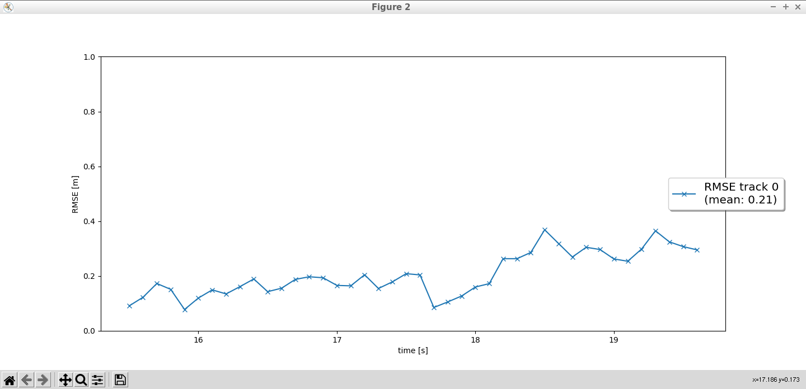
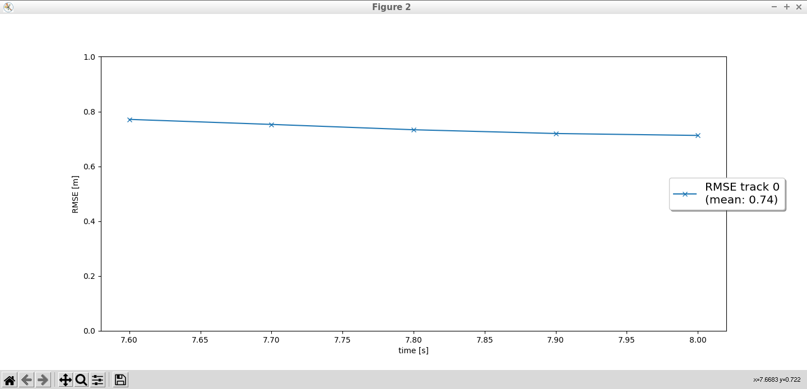
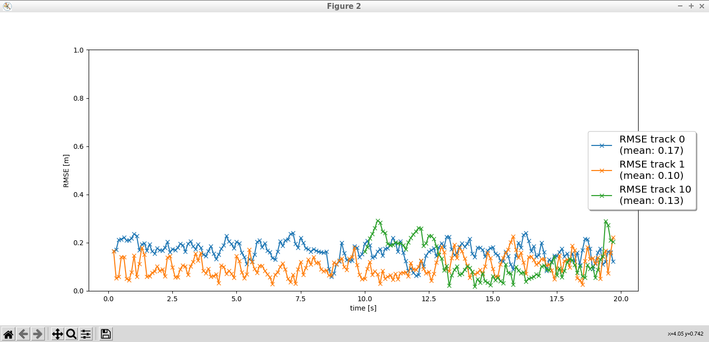

This is the writeup for the part 2 of the Sensor Fusion and Tracking project

RMSE graph for step 1

RMSE graph for step 2

RMSE graph for step 3

### 1. Write a short recap of the four tracking steps and what you implemented there (filter, track management, association, camera fusion). Which results did you achieve? Which part of the project was most difficult for you to complete, and why?
1) Filter - The kalman filter is updated for each measurement reading from lidar and camera for each track. The values from the kalman filter are used to calculate the Mahalanobis distance.
2) Track Management - Track management is used to track vehicles detected by sensors (lidar and camera). If a new measurement is detected, track management determines if it is a false positive, or ghost track. A ghost track is when the sensor detects a vehicle that isn't there.
3) Association - Association checks if the measurement is for the same vehicle or a new vehicle. We used the chi-squared percent point function to determine this.
4) Camera fusion - We first read from lidar, update the filter, then read from camera, and finally update the filter again

We use all the above to calculate the Mahalanobis distance, via kalman filter, between sensors to determine if it is the same vehicle based on chi2 percent point function.

The most difficult to complete was track management and association. Significant amount of time was spent on determining track score and gating. Removing ghost tracks was difficult because we have to experiment with the chi2 percentage.

### 2. Do you see any benefits in camera-lidar fusion compared to lidar-only tracking (in theory and in your concrete results)? 
Lidar has limitations such as inaccuracies when there's bad weather and not so reflective surfaces. The camera helps overcome the shortcomings/uncertainty of lidar.

### 3. Which challenges will a sensor fusion system face in real-life scenarios? Did you see any of these challenges in the project?
One challenge is the camera seeing a vehicle far away but lidar doesn't detect it. The vehicle will be tentative status for a long time because the camera increments the score but lidar decrements the score.

### 4. Can you think of ways to improve your tracking results in the future?
1) Remove tenative status vehicle after 15 frames
2) Experiment with the initial state like q (process noise variable) to reduce RMSE
